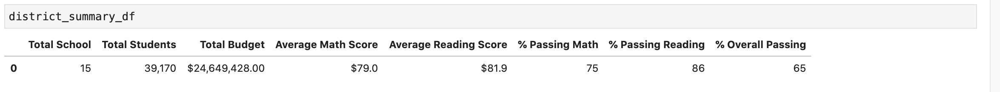
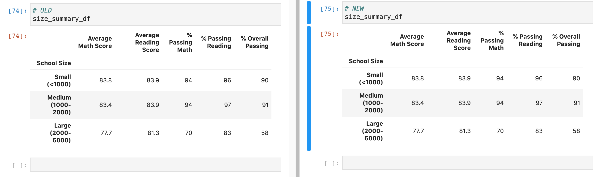

# School  District Analysis.
-

##Overview

- Chief data analyst Maria asked for help to put together data on school performance. The bulk of this task to aggregate data and create a singular frames odf data to perform analysis.
Some of this data had to be carefully considered and not considered  to ensure data integrity.This data will be presented  to the school board to provide insight on school performance in relationship to school, district, type and budget. 

## Results
- The District Summary did not have a signicant change after the adjustment. Please see image below.   

- The school summary also did not see any change after the data correction. Thomas High School did not see any major change either. The stats only changed by minimal decimal points. 
 

 - Math and reading socres  by grade decreased slightly.
 - Scores by School and school size remained the same
 -  

##Summary

Although, there was not any significant change after the data correction, it is good practice to ensure data integrity is considered before providing analysis. In this case, the ninth graders' data did not skew the results. Math and reading scores shifted slihgtly but not enough the change any insights.